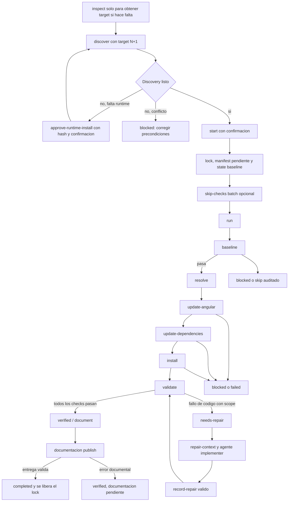
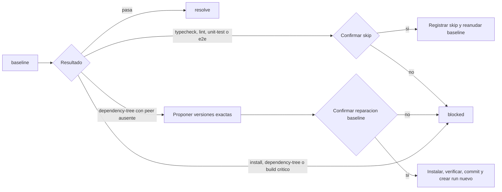
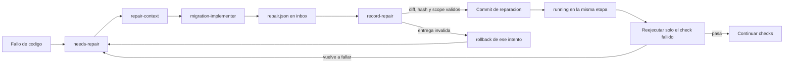
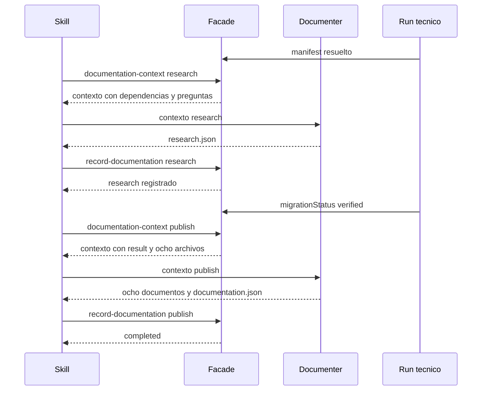

# Flujo del pipeline de migracion Angular v5

Este documento explica como se mueve un run de Angular Migration v5 desde la primera inspeccion hasta el cierre documental. La fuente de autoridad es el controlador de la pipeline, principalmente `scripts/angular-migration.ps1`, `Migration.Pipeline.psm1` y `Migration.State.psm1`. La skill coordina el trabajo conversacional y los agentes aportan reparaciones o documentacion, pero ninguno de ellos decide las versiones, el orden de las etapas ni el estado final.

La regla que organiza todo el flujo es que un run hace exactamente un salto de major: si el proyecto parte de Angular `N`, el objetivo valido es `N + 1`. Para que el proceso sea reanudable, cada frontera se guarda en `.angular-migration/runs/<run-id>/state.json`, los eventos se agregan en `events.jsonl` y un lock exclusivo impide que dos procesos modifiquen el mismo proyecto al mismo tiempo.

## Vista general

El flujo comienza fuera del run, con `discover`, que no modifica el proyecto y persiste
`.angular-migration/repo.json`. Discovery fija la major siguiente, el plan de runtimes
por operación y los riesgos conocidos. Si falta una versión exacta, la instalación de
fnm requiere una propuesta hasheada y una confirmación explícita. Solo cuando el
discovery está listo y el usuario confirma `start` se crea la unidad de trabajo y se
conserva el lock. A partir de ese momento, `run` ejecuta las etapas técnicas en orden
y solo avanza cuando la etapa actual ha dejado sus postcondiciones, sus logs y, cuando
corresponde, su commit de checkpoint.



La distincion mas importante del diagrama es la existente entre `verified` y `completed`. `verified` significa que la migracion tecnica y sus checks terminaron correctamente. `completed` solo aparece despues de que la documentacion final ha sido validada y registrada. Por eso una migracion puede estar tecnicamente verificada y, sin embargo, seguir reteniendo el lock mientras espera investigacion o publicacion documental.

## Entrada y creacion del run

La skill es el punto de entrada conversacional, pero todas sus operaciones pasan por la fachada `scripts/angular-migration.ps1`. `preflight` e `inspect` siguen disponibles como diagnósticos, pero el flujo operativo comienza con `discover`. El controlador comprueba que el proyecto sea un proyecto Angular CLI soportado, que use npm y `package-lock.json`, que el repositorio Git esté limpio y que exista un plan de runtimes exactos mediante fnm para las operaciones de metadata, baseline, actualización, instalación y validación. Discovery persiste el snapshot en `repo.json`, pero no crea run ni ejecuta gates.

Si discovery está listo, la skill pide confirmación antes de llamar a `start`. Si falta un runtime, presenta la propuesta exacta y su hash; `approve-runtime-install` solo instala después de `-Confirmed` y vuelve a descubrir. El objetivo recibido debe ser exactamente la major siguiente. `start` genera un `runId`, crea `.angular-migration/active.lock`, prepara el directorio del run, copia el runtime inmutable del hook y persiste dos documentos iniciales: un `manifest.json` con la fotografía pendiente del proyecto y un `state.json` en `running/baseline`. También registra el evento `run-started`. Tras crear el run, la skill puede registrar una única selección de skips opcionales mediante `skip-checks` y el input fijo `inbox/skips.json`. En este punto todavía no se han resuelto versiones ni se ha ejecutado `ng update`.

La fachada devuelve un unico envelope JSON por llamada. El envelope contiene `schemaVersion`, el comando, `ok`, `status`, `data` y `error`. Los logs completos de procesos externos no se imprimen como progreso: se guardan dentro del run y el envelope devuelve referencias relativas y diagnosticos resumidos. Los estados normales terminan con codigo de salida `0`, una accion humana en `blocked` o `needs-repair` termina con `2`, y un fallo interno o irrecuperable termina con `1`.

## Baseline antes de modificar el proyecto

La etapa `baseline` ejecuta los checks que el proyecto ya declara, antes de crear la rama de migracion o tocar sus dependencias. La finalidad es separar un problema preexistente de un problema introducido por el salto de Angular. Un check que no esta configurado se conserva como `not-configured`; no se convierte artificialmente en `passed`.

Si todos los checks configurados pasan, el controlador confirma la operacion `baseline` y avanza a `resolve`. Si un check falla o expira, el run queda bloqueado y el lock se libera porque el proyecto todavia no ha sido modificado por la migracion. Los checks `typecheck`, `lint`, `unit-test` y `e2e` pueden omitirse unicamente con razon y confirmacion explicitas. La omision queda registrada en `state.json`, `events.jsonl` y en el resultado tecnico cuando exista. `install`, `dependency-tree` y `build` son gates criticos y no admiten `skip-check`.

Existe una ruta especial para un `dependency-tree` de baseline que reporta peers npm ausentes. La skill solicita `baseline-dependency-context`, que produce una propuesta con nombres, rangos, paquetes que requieren cada peer y versiones exactas consultadas en el registry. Solo despues de una confirmacion explicita `approve-baseline-dependencies` instala esas versiones, ejecuta `npm ls --all`, comprueba que solo cambiaron `package.json` y `package-lock.json`, crea un commit controlado y devuelve la instruccion de comenzar un run nuevo. El run bloqueado no se reanuda, porque la baseline del proyecto cambio y debe volver a comprobarse desde cero.

El siguiente flujo resume las decisiones especiales de esta etapa:



## Resolucion y rama de migracion

En `resolve`, el controlador consulta la metadata necesaria del registry y convierte el manifest pendiente en una decision exacta. El manifest resuelto fija las versiones de Angular y de las dependencias directas, sus secciones, los rangos que se escribiran despues y la metadata de `ngUpdate` cuando exista. Una vez calculado `manifestSha256`, el manifest se vuelve inmutable. Un cambio posterior del contenido o del hash hace fallar el run con `manifest_integrity_failed`.

Cuando la resolucion termina, el controlador crea una rama dedicada desde el commit inicial. La rama sigue el formato `migration/angular-<source>-to-<target>-<suffix>` y no se reutiliza si ya existe. El checkpoint de esta frontera sigue apuntando al commit inicial, de modo que todas las operaciones posteriores pueden comprobar que Git continua en la rama y en el punto que el estado espera.

La investigacion documental puede empezar en este momento. La skill obtiene `documentation-context -Mode research` cuando el manifest ya esta resuelto y entrega ese contexto al documenter. Esa investigacion puede ejecutarse mientras la migracion tecnica continua, pero solo produce evidencia de cambios oficiales y preguntas pendientes; no autoriza a publicar documentacion final ni a declarar que la migracion ha terminado.

## Actualizacion de Angular

La etapa `update-angular` usa exclusivamente la CLI local del proyecto, ubicada en `node_modules/.bin/ng.cmd`. No usa una CLI global ni `npx`. Los argumentos se construyen desde el manifest resuelto, y la primera operacion actualiza `@angular/core` y `@angular/cli` con versiones exactas. Despues se ejecutan, en orden alfabetico, las migraciones de los paquetes oficiales Angular y de los paquetes externos Angular-aware que declaran metadata `ngUpdate`.

Cada comando externo se registra con sus logs, codigo de salida, timeout y duracion. Despues de cada comando se validan las postcondiciones y se crea el checkpoint con el mensaje de commit controlado. Si el comando falla, el controlador revierte unicamente los cambios de esa operacion hasta el checkpoint anterior. Un conflicto de versiones, peers o integridad es `blocked`; un error de codigo con rutas identificables genera un `failure-context` y lleva el run a `needs-repair/update-angular`; un fallo del propio controlador o del rollback es `failed`.

## Actualizacion de dependencias

`update-dependencies` no vuelve a resolver versiones. Toma las decisiones ya fijadas en el manifest y hace primero una representacion exacta de `package.json`. Despues ejecuta `npm install --package-lock-only`, verifica que cada dependencia directa del lockfile coincide exactamente con `targetVersion`, vuelve a representar `package.json` usando sus `writeSpec` declarados y comprueba que cada rango admite la version bloqueada. Tambien verifica que no se haya añadido, eliminado o movido ninguna dependencia directa sin una decision en el manifest.

Si las comprobaciones pasan, se crea el checkpoint de dependencias y la pipeline avanza a `install`. Si npm resuelve una version distinta, si el renderer no puede escribir el manifest o si falla el lockfile, el controlador revierte la operacion y bloquea el run. Esta clase de fallo no se entrega al implementer, porque el agente nunca puede editar `package.json` ni `package-lock.json`.

## Instalacion reproducible

La etapa `install` ejecuta exactamente `npm ci` y, despues, `npm ls --all`. Antes de comenzar guarda los hashes de `package.json` y `package-lock.json`, y al terminar comprueba que `npm ci` no los haya modificado. El arbol debe terminar sin entradas `invalid`, `extraneous` o `missing`. Los logs quedan asociados a la etapa.

Un fallo de instalacion, integridad o arbol de dependencias es `blocked`. La pipeline revierte los cambios producidos por la operacion y no llama al implementer, porque no seria seguro pedir a un agente que arreglara una incompatibilidad de dependencias fuera de su alcance. Solo cuando `npm ci` y `npm ls --all` pasan se confirma `install` y se entra en `validate`.

## Validacion tecnica

La etapa `validate` ejecuta los checks configurados en el orden `typecheck`, `lint`, `unit-test`, `build` y `e2e`. Los checks `not-configured` se conservan con ese estado y no se ejecutan. La pipeline detiene los checks posteriores en cuanto encuentra un fallo.

Si todos los checks pasan, se crea `result.json` con los checks, los cambios derivados del manifest, los commits, los warnings y solo los summaries de reparaciones accepted que tienen un `verification-passed` correspondiente. El resultado recibe un hash propio y se vuelve inmutable. El estado se actualiza a `verified/document`, `migrationStatus` pasa a `verified` y el lock se mantiene para que el tramo documental pueda terminar el mismo run.

Si un check de codigo falla, el controlador normaliza el diagnostico, calcula un fingerprint y construye un contexto de reparacion con logs referenciados y rutas permitidas. El run queda en `needs-repair/validate` y conserva el lock. No se considera que el agente haya arreglado nada hasta que el controlador valide el diff real y vuelva a ejecutar el check.

## Reparacion controlada

La reparacion tiene un ciclo deliberadamente cerrado. El implementer recibe el JSON de `repair-context`, lee el diagnostico y solo puede editar rutas incluidas en `allowedPaths`; las rutas de `forbiddenPaths` prevalecen siempre. No puede escoger versiones ni ejecutar `npm`, `npx`, `ng`, `git` u otros comandos arbitrarios. Su unica ejecucion permitida es invocar la fachada para obtener el contexto o entregar `record-repair` con los argumentos recibidos.



`record-repair` comprueba ownership, fingerprint, attempt, hash del manifest, HEAD en el checkpoint, schema cerrado, diff real de Git, containment de rutas, ausencia de cambios de modo o enlaces y hashes de archivos protegidos. Si la entrega es valida, archiva el informe, crea un commit fijo, incrementa el contador total y vuelve a `running` sin saltar de etapa. Entonces `run` reejecuta el check que fallo y continua con los siguientes si pasa.

Si la entrega no coincide con el contexto, se revierte solo el intento nuevo y el run permanece en `needs-repair`, salvo una violacion de scope o un rollback imposible. El rechazo queda en el `repair.jsonl` local como `submission-rejected`; no se copia todo el detalle a `events.jsonl` ni se acumula en `state.json`. El mismo fingerprint admite como maximo tres intentos y el run admite como maximo cinco reparaciones totales. Agotar esos limites produce un bloqueo; consultar `status` o volver a pedir el mismo contexto no cuenta como una reparacion nueva.

### Historial local y verificacion

Cada fingerprint deriva una ruta aislada:

```text
.angular-migration/runs/<run-id>/repair-history/<64-hex>/repair.jsonl
```

El controlador es el único escritor. Cada línea es JSON compacto UTF-8 sin BOM,
terminada en newline, con schema cerrado, secuencia continua, identidad y
`entrySha256`. El archivo conserva `context-issued`, `submission-received`,
`submission-rejected`, `submission-accepted`, `verification-failed`,
`verification-passed` y `attempts-exhausted`; el directorio no usa `sha256:` como
prefijo. El implementer solo puede leer el archivo exacto de su contexto y debe
consultarlo cuando hay intentos previos para no repetir un enfoque ya rechazado.

`submission-accepted` significa que el diff fue validado y committed. El gate que se
ejecuta después decide si la reparación se vuelve efectiva: `verification-passed`
cierra el contexto y `verification-failed` consume el ciclo. Si el fingerprint sigue
siendo el mismo, el siguiente contexto conserva el mismo historial y su
`historyCheckpointCommit`; si cambia, se crea un historial nuevo. `checkpointCommit`
puede avanzar con cada commit accepted, pero el checkpoint estable de history no
cambia.

Una interrupción entre append, commit, escritura de state o transición no reejecuta
una mutación por intuición. Al reanudar, el controlador compara historial, informe
archivado, HEAD y eventos, completa las postcondiciones demostrables y crea el
siguiente contexto solo cuando el diagnóstico y el scope son recuperables. Un JSONL
truncado, un hash alterado, una secuencia inválida o evidencia ambigua bloquea con
`repair_history_corrupt` o `repair_history_state_mismatch`.

## Investigacion y publicacion documental

El documenter tiene dos momentos distintos. En `research` trabaja desde el manifest resuelto y consulta fuentes primarias para identificar cambios oficiales, cambios observados en el run, inferencias y cambios no aplicables. Solo escribe el JSON de investigacion en el inbox del run. El controlador lo valida, lo mueve a `artifacts/research.json`, calcula su hash y registra el estado `researched`.

El modo `publish` espera hasta que `migrationStatus=verified`, la investigacion este registrada, el resultado tecnico sea valido y el HEAD coincida con el commit tecnico verificado. El contexto de publicacion fija `docs/migration/v<target>` como salida y exige exactamente ocho documentos. El contexto expone como evidencia el directorio de historial del run, pero el hook autoriza solo los `repair.jsonl` de fingerprints accepted por `state.json`; el documenter puede leerlos para explicar intentos relevantes, pero no puede modificarlos. La documentación final presenta como reparación aplicada únicamente una entrada con `submission-accepted` y `verification-passed`.



Un error durante la investigacion o la publicacion no convierte automaticamente una migracion tecnica verificada en una migracion tecnica fallida. El estado documental puede quedar en `failed` y el run seguira sin ser `completed`; el lock permanece hasta que la documentacion valida se registre o exista una intervencion manual conforme a la politica local.

## Estado, reanudacion y lock

El estado persistido separa `status`, `stage`, `migrationStatus` y el estado documental. Las transiciones tecnicas normales son `running/baseline` hacia `running/resolve`, luego `update-angular`, `update-dependencies`, `install` y `validate`, y finalmente `verified/document`. Un `needs-repair` solo vuelve a `running` en la misma etapa despues de un `record-repair` valido. `verified/document` solo puede pasar a `completed/done` despues de un `record-documentation` publish valido.

La entrada a `run` vuelve a comprobar ownership, integridad del manifest, rama, HEAD, working tree y operaciones activas. Una operacion no mutante que quedo interrumpida se puede repetir. Una operacion mutante con finish y checkpoint confirmados se marca como completada sin repetirse. Si una operacion mutante quedo interrumpida con cambios sucios, el controlador restaura su checkpoint, elimina solo los untracked creados por esa operacion y deja el run bloqueado con un diagnostico de rollback; no usa `git clean` ni toca cambios preexistentes.

El lock se mantiene mientras el run esta `running`, `needs-repair` o `verified` con documentacion pendiente. Se libera despues de persistir un diagnostico definitivo en `blocked` o `failed`, y se libera al completar la documentacion y verificar la escritura final. La eliminacion comprueba siempre que el lock pertenece al mismo `runId`; nunca se elimina un lock ajeno.

Los artefactos del run forman la memoria auditable del proceso. En `.angular-migration/runs/<run-id>/` se guardan el manifest, el state, los eventos append-only, el resultado tecnico, la investigacion archivada, los informes de reparacion, las entregas documentales y los logs separados por etapa. `state.json` es el resumen mutable; el manifest resuelto y `result.json` quedan protegidos por hashes; `events.jsonl` conserva la secuencia de hechos sin reescritura.

## Que permite comprobar este flujo

La pipeline tiene dos barreras independientes. La primera responde a la pregunta tecnica: el proyecto pudo pasar de una major a la siguiente con versiones exactas, checkpoints Git y gates reproducibles. La segunda responde a la pregunta documental: existe una explicacion sustentada por el run y por fuentes primarias. Por eso la investigacion puede adelantarse, pero la publicacion no puede adelantarse a `verified`.

Tambien queda separado el papel de los agentes. El implementer no puede ampliar su alcance ni cambiar la receta de migracion; solo propone una reparacion que el controlador verifica. El documenter no puede convertir una recomendacion en un hecho ni declarar el estado final. En ambos casos, el controlador conserva la autoridad sobre archivos, hashes, commits, transiciones y lock.

En resumen, `run` es una ejecucion determinista y reanudable, no una secuencia de decisiones libres del agente. Si una precondicion o una dependencia no es compatible, el resultado esperado es `blocked`. Si el codigo necesita una correccion acotada, el resultado intermedio es `needs-repair`. Solo la combinacion de migracion tecnica `verified` y documentacion `completed` permite llegar a `completed` y liberar el proyecto.
