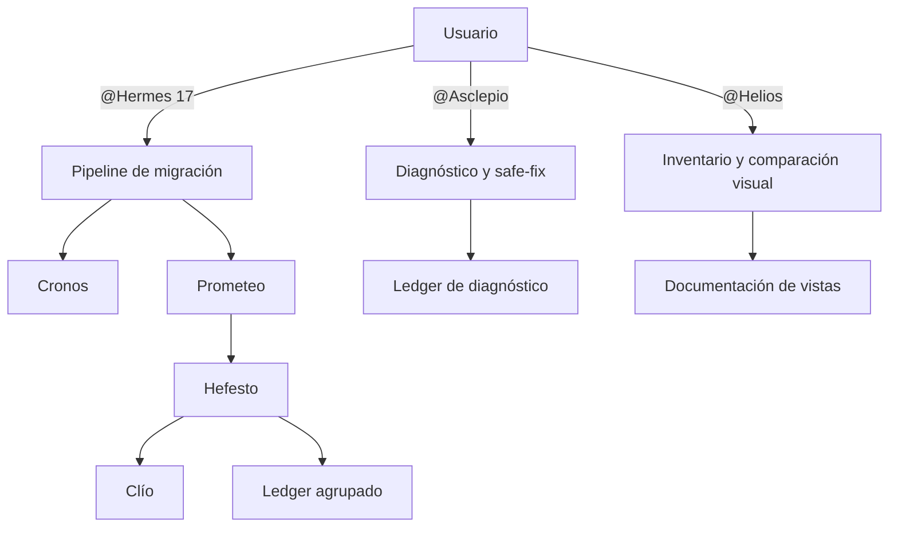

# Informe de implementación - Angular Migration Plugin v3

## Resumen

La versión 3 amplía el plugin en tres áreas:

1. La pipeline de migración ahora deja un registro estructurado de todos los cambios realizados.
2. Se añade **Asclepio**, un agente independiente que revisa el código y aplica únicamente correcciones mecánicas seguras.
3. Se añade **Helios**, otro agente independiente que documenta las vistas Angular y compara visualmente dos despliegues.

Hermes continúa dedicado exclusivamente a migrar Angular major por major. Asclepio y Helios no forman parte de su pipeline y se invocan directamente cuando se necesitan.

La versión publicada en `plugin.json` y en el marketplace interno pasa a ser `3.0.0`.

---

## 1. Motivo de la versión 3

### Problema del registro anterior

La versión 2 conservaba logs de comandos, builds y runtime, pero no explicaba de forma estructurada qué transformación se había aplicado en cada fichero.

Por ejemplo, si una misma corrección se aplicaba en 40 componentes, el resultado podía terminar como 40 mensajes repetidos o como una lista poco precisa. Esto dificultaba responder preguntas sencillas:

- ¿Qué cambio se realizó?
- ¿Por qué se realizó?
- ¿Cuántas veces se aplicó?
- ¿Qué ficheros fueron afectados?
- ¿Cómo se comprobó que el cambio era correcto?
- ¿Quedó algún fichero modificado sin explicación?

### Necesidad de herramientas fuera de la migración

También existían dos trabajos útiles que no debían aumentar las responsabilidades de Hermes:

- Revisar un proyecto Angular y corregir incompatibilidades mecánicas sin ejecutar una migración.
- Documentar todas las vistas de una aplicación y detectar diferencias visuales entre dos URLs.

Por este motivo, ambos trabajos se implementan como agentes autónomos.

---

## 2. Arquitectura resultante



La pipeline de Hermes conserva sus cuatro subagentes declarados:

- Cronos.
- Prometeo.
- Hefesto.
- Clío.

Asclepio y Helios tienen `user-invocable: true`, pero no aparecen dentro de la lista de agentes de Hermes.

---

## 3. Ledger de cambios agrupados

### Qué es

El ledger es un fichero JSON que actúa como fuente de verdad de los cambios realizados durante una migración o un diagnóstico.

En una migración se guarda en:

```text
.angular-migration/v{from}-v{to}.log/changes-v{to}.json
```

En un diagnóstico de Asclepio se guarda dentro del directorio de esa ejecución:

```text
.angular-migration/diagnostics/{timestamp}/changes.json
```

### Cómo agrupa los cambios

Cada transformación aparece una sola vez dentro de `groups`. Todas las ubicaciones afectadas se añaden a su array `occurrences`.

La agrupación usa:

- Identificador de la regla.
- Transformación aplicada.
- Motivo del cambio.

El nombre del fichero no forma parte de la clave. Por tanto, una transformación aplicada en 40 ficheros produce un grupo con `count: 40`, no 40 explicaciones repetidas.

Cada grupo conserva:

- `id`: identificador estable.
- `category`: tipo de código afectado.
- `source`: origen del cambio, como schematic, cambio manual, formatter o linter.
- `summary`: explicación breve.
- `reason`: motivo técnico.
- `transformation`: patrón anterior y resultado esperado.
- `occurrences`: ficheros, ubicaciones y estado.
- `validation`: comprobación que confirmó el cambio.
- `commit`: commit relacionado, cuando existe.

### Nuevos comandos del script

Se añadieron cuatro comandos a `scripts/angular-migration.ps1`:

| Comando          | Función                                                                  |
| ---------------- | ------------------------------------------------------------------------ |
| `changes-init`   | Crea un ledger vacío con información de la ejecución y timestamps.       |
| `changes-record` | Añade una ocurrencia y la incorpora al grupo semántico correspondiente.  |
| `changes-close`  | Ordena el contenido, calcula contadores y valida cobertura e integridad. |
| `changes-read`   | Devuelve el ledger como JSON estructurado.                               |

### Seguridad e integridad

La implementación incluye las siguientes protecciones:

- Las rutas de artefactos deben permanecer dentro de la raíz del proyecto.
- Las rutas registradas en una ocurrencia deben ser relativas y no pueden contener segmentos `..`.
- El ledger se escribe primero en un fichero temporal y después se renombra, reduciendo el riesgo de corrupción por una interrupción.
- No se puede registrar contenido después de cerrar el ledger.
- Los estados permitidos son `applied`, `skipped` y `failed`.
- Los orígenes permitidos son `manual`, `schematic`, `formatter` y `linter`.
- Un grupo aplicado debe indicar cómo fue validado.
- `count` se calcula a partir de `occurrences`; no se confía en un contador proporcionado manualmente.
- Un fichero modificado debe aparecer en alguna ocurrencia o en una exclusión justificada.

El contrato formal está en `schemas/changes.schema.json`.

### Por qué se implementó en el script

La agrupación y validación no se dejaron a interpretación de los agentes. Se implementaron en PowerShell porque el script ya es la API determinista compartida por la pipeline.

Esto evita que cada agente genere una variante diferente del formato y permite comprobar el mismo contrato mediante tests.

---

## 4. Integración con la pipeline existente

### Hefesto

Hefesto ahora:

1. Inicializa el ledger antes de ejecutar `ng update`.
2. Conserva las transformaciones realizadas por schematics, cambios manuales, linters y formatters.
3. Registra cada ubicación mediante `changes-record`.
4. Obtiene el diff real del salto.
5. Cierra el ledger usando todos los ficheros del diff como lista de cobertura.
6. Solo ejecuta `complete-step` si el ledger se cierra correctamente.
7. Incluye en su reporte la ruta del ledger y sus contadores.

Así, un build verde ya no es suficiente por sí solo: también debe existir una explicación estructurada de lo que cambió.

### Hermes

Hermes valida, antes de aceptar un salto, que:

- El ledger exista.
- Esté cerrado.
- Sus contadores coincidan con el reporte de Hefesto.
- Cada fichero del diff esté explicado o tenga una exclusión con motivo.

Si alguna condición falla, el salto se considera fallido y entra en el ciclo de recuperación.

### Clío

Clío recibe ahora cuatro entradas:

- Snapshot.
- Plan.
- Reporte.
- Ledger de cambios.

El changelog humano incluye una tabla de grupos con resumen, motivo, origen, cantidad y validación. Las ubicaciones pueden mostrarse dentro de bloques desplegables para evitar repetir la misma explicación muchas veces.

---

## 5. Asclepio: reconocimiento y correcciones mecánicas

### Qué hace

Asclepio es un agente autónomo para revisar un proyecto Angular sin ejecutar la pipeline de migración.

Se invoca con:

```text
@Asclepio
```

También dispone de un modo de solo diagnóstico:

```text
@Asclepio scan-only
```

### Flujo de trabajo

Asclepio:

1. Comprueba que está en la raíz de un proyecto Angular.
2. Lee `package.json`, lockfile, `angular.json`, tsconfigs y configuración de lint.
3. Detecta versiones declaradas de Angular, TypeScript, RxJS, Ionic y Node.
4. Descubre los scripts y herramientas que el proyecto ya utiliza.
5. Escanea todo `src/`, respetando exclusiones y evitando dependencias o artefactos generados.
6. Ejecuta checks de solo lectura disponibles, como lint, typecheck, tests no interactivos y build.
7. Evalúa el catálogo de reglas compatible con las versiones detectadas.
8. Clasifica los hallazgos como `safe-fix`, `review` o `informational`.
9. En modo normal aplica únicamente `safe-fix`.
10. Repite el check más estrecho que pueda demostrar que el cambio funciona.
11. Genera inventario, hallazgos, logs, ledger y un informe Markdown.

### Límites

Asclepio no puede:

- Cambiar versiones o dependencias.
- Modificar lockfiles.
- Instalar herramientas.
- Cambiar APIs o lógica de negocio.
- Aplicar correcciones ambiguas.
- Borrar ficheros.
- Hacer commit, push, reset o cambios de rama.
- Usar `--force`.

Si una corrección requiere interpretar intención de negocio, queda marcada como `review` y no se aplica.

### Catálogo inicial

El catálogo está en `rules/angular-patterns.json` e incluye cuatro reglas iniciales:

| Regla                    | Clasificación | Comportamiento                                                                                  |
| ------------------------ | ------------- | ----------------------------------------------------------------------------------------------- |
| `zone-legacy-entrypoint` | `safe-fix`    | Sustituye el import antiguo `zone.js/dist/zone` por `zone.js`.                                  |
| `removed-enable-ivy`     | `safe-fix`    | Elimina la propiedad retirada `enableIvy` de tsconfigs compatibles.                             |
| `rxjs-deep-import`       | `review`      | Detecta imports internos de RxJS, pero no los modifica porque el reemplazo depende del símbolo. |
| `ionic-css-attribute`    | `review`      | Detecta atributos CSS antiguos de Ionic, pero no modifica templates ambiguos.                   |

### Artefactos

```text
.angular-migration/diagnostics/{timestamp}/
├── inventory.json
├── findings.json
├── changes.json
└── logs/

docs/diagnostics/
└── diagnostic-{date}.md
```

### Naturaleza de la implementación

El flujo de reconocimiento está implementado como contrato operativo en `agents/Asclepio.agent.md`. El agente usa las herramientas del editor y del proyecto para realizar el inventario y los checks.

No se ha creado un segundo scanner ejecutable que duplique ESLint, TypeScript o Angular CLI. La parte determinista compartida es el catálogo de reglas y el ledger.

---

## 6. Helios: documentación y comparación visual

### Qué hace

Helios documenta las rutas Angular y compara visualmente las mismas vistas entre dos despliegues.

Se invoca con:

```text
@Helios
```

### Conversación en cinco fases

Helios sigue deliberadamente esta secuencia:

1. Pide la URL y el archivo de autenticación local de referencia.
2. Descubre las rutas y captura todas las vistas base.
3. Solo entonces pide la URL y el archivo de autenticación local candidato.
4. Captura las mismas rutas y compara los resultados.
5. Escribe el inventario y el informe de diferencias.

No solicita la URL ni la autenticación candidata al principio. De esta forma, la referencia queda terminada y verificada antes de iniciar la comparación.

### Descubrimiento de rutas

El contrato de Helios le obliga a inspeccionar todos los source roots y seguir:

- `Routes`.
- `RouterModule.forRoot` y `RouterModule.forChild`.
- `provideRouter`.
- `children`.
- `loadChildren` y módulos lazy.
- Redirects.
- Rutas standalone.
- Wildcards.

Las rutas con parámetros desconocidos se documentan como `blocked`. Cuando una URL requiere autenticación, Helios pide un archivo local de credenciales para esa URL; no inventa parámetros ni intenta evitar las protecciones de la aplicación.

La interacción está dividida en cinco fases: URL y autenticación base; descubrimiento y captura completa de la referencia; URL y autenticación candidata; captura y comparación con el mismo manifiesto de rutas; e informe final. El archivo local puede contener HTTP Basic (`username` y `password`) o una referencia a un `storageState` de Playwright. Los secretos nunca se solicitan ni se registran en el chat.

El manifiesto de rutas usa `schemas/vision.schema.json`.

### Runner visual

La captura y comparación sí están implementadas como código determinista en `scripts/playwright-vision.js`.

El runner utiliza:

- Playwright y Chromium para navegar y capturar.
- `pixelmatch` para comparar píxeles.
- `pngjs` para leer y generar PNG.

Estas dependencias se instalan en el runtime aislado del plugin. No modifican el `package.json` ni `node_modules` de la aplicación analizada.

### Nuevo comando `vision-run`

`scripts/angular-migration.ps1` expone `vision-run` para que Helios no tenga que construir comandos Node manualmente.

El comando:

- Valida que manifiesto y directorios permanezcan dentro del proyecto.
- Comprueba que el runtime visual esté completo.
- Ejecuta el runner con Node 20 o superior mediante `fnm` o `nvm`.
- Aplica un timeout de 30 minutos.
- Devuelve JSON estructurado.

Tiene dos modos:

| Modo       | Función                                                             |
| ---------- | ------------------------------------------------------------------- |
| `baseline` | Captura y conserva todas las vistas de referencia.                  |
| `compare`  | Captura y conserva la candidata, compara y publica las diferencias. |

### Capturas reproducibles

Para reducir falsos positivos, el runner fija:

- Viewport.
- Locale `es-ES`.
- Zona horaria UTC.
- Esquema de color claro.
- Device scale factor 1.
- Reduced motion.
- Animaciones y transiciones desactivadas.
- Espera de `document.fonts.ready`.
- Una espera limitada de red estable.

También admite selectores de máscara para contenido dinámico.

### Comparación y almacenamiento

El umbral predeterminado es `0.1%` de píxeles diferentes.

Para una vista diferente se conservan:

```text
baseline.png
candidate.png
diff.png
```

Si cambian las dimensiones, se considera una diferencia y también se genera un mapa `diff.png`.

Cuando una vista es idéntica:

- Se registra como `unchanged`.
- Su captura queda conservada en `baseline/` y `candidate/`.
- No se publica ningún PNG de comparación.

### Privacidad y seguridad

El runner elimina de las URLs registradas:

- Usuario y contraseña.
- Query string.
- Fragmento hash.

Helios no rellena formularios de login ni ejecuta acciones destructivas. Usa únicamente el archivo local de autenticación que el usuario proporciona para crear el contexto de Playwright; no muestra ni registra su contenido, cookies, tokens o credenciales.

### Artefactos

```text
.angular-migration/vision/{run-id}/
├── routes.json
├── baseline.json
├── comparison.json
└── temp/                 # eliminado tras comparar

docs/views/
├── _index.md
└── comparisons/{run-id}/
    ├── report.md
    └── {route}/{viewport}/
        ├── baseline.png
        ├── candidate.png
        └── diff.png
```

Las carpetas con PNG solo existen para rutas diferentes.

### Naturaleza de la implementación

El descubrimiento estático del router y la generación de documentación están definidos como flujo del agente en `agents/Helios.agent.md`.

La navegación, captura, comparación, métricas, saneado de URLs y limpieza de imágenes están implementados en código ejecutable y cubiertos por el smoke visual.

---

## 7. Schemas añadidos

### `changes.schema.json`

Define la forma pública del ledger:

- Metadata de ejecución.
- Estado abierto o cerrado.
- Grupos.
- Ocurrencias.
- Validación.
- Contadores globales.

### `vision.schema.json`

Define el manifiesto visual:

- Rutas visitables o bloqueadas.
- Motivo de bloqueo.
- Viewports.
- Selectores de máscara.

Los schemas permiten revisar y evolucionar los formatos sin depender de ejemplos informales.

---

## 8. Pruebas implementadas

### Smoke principal

`tests/smoke.ps1` conserva las pruebas v2 y añade comprobaciones v3:

- Existencia de los comandos del ledger y `vision-run`.
- Creación y lectura de un ledger.
- Agrupación de 40 ocurrencias como un único grupo.
- Cálculo correcto de grupos, ocurrencias y ficheros.
- Rechazo de un fichero modificado sin explicación.
- Validez JSON de schemas y catálogo de reglas.
- Asclepio invocable y limitado a `safe-fix`.
- Secuencia de URLs de Helios.
- Confirmación de que los nuevos agentes no pertenecen a Hermes.

### Smoke visual

`tests/vision-smoke.ps1` levanta un servidor HTTP local con dos versiones controladas:

- Una vista diferente.
- Una vista idéntica.

La prueba confirma que:

- El runtime visual se prepara correctamente.
- El baseline captura ambas rutas.
- La comparación detecta una diferencia y una igualdad.
- Solo la vista diferente publica baseline, candidata y diff.
- Las capturas temporales e iguales se eliminan.

Los fixtures viven en `tests/vision-fixture/` y no dependen de una aplicación externa.

### Comandos de validación

```powershell
powershell -NoProfile -File tests\smoke.ps1
powershell -NoProfile -File tests\vision-smoke.ps1
git diff --check
```

Las dos suites finalizaron correctamente durante la implementación.

---

## 9. Ficheros principales de la versión 3

| Fichero                         | Responsabilidad                                    |
| ------------------------------- | -------------------------------------------------- |
| `agents/Asclepio.agent.md`      | Contrato del agente de reconocimiento y safe-fix.  |
| `agents/Helios.agent.md`        | Contrato del agente de rutas y comparación visual. |
| `agents/Hefesto.agent.md`       | Producción y cierre del ledger durante cada salto. |
| `agents/Hermes.agent.md`        | Gate de integridad y cobertura del ledger.         |
| `agents/Clio.agent.md`          | Conversión del ledger en documentación humana.     |
| `scripts/angular-migration.ps1` | API del ledger, runtime aislado y `vision-run`.    |
| `scripts/playwright-vision.js`  | Captura y comparación determinista de imágenes.    |
| `rules/angular-patterns.json`   | Reglas iniciales de Asclepio.                      |
| `schemas/changes.schema.json`   | Contrato JSON de cambios agrupados.                |
| `schemas/vision.schema.json`    | Contrato JSON del manifiesto visual.               |
| `tests/smoke.ps1`               | Validación funcional del script y contratos v3.    |
| `tests/vision-smoke.ps1`        | Validación visual end-to-end.                      |
| `docs/v3-plan.md`               | Diseño y criterios de aceptación originales.       |

---

## 10. Uso rápido

### Migrar Angular

```text
/update-angular 17
```

o:

```text
@Hermes 17
```

### Revisar y aplicar fixes seguros

```text
@Asclepio
```

### Revisar sin editar

```text
@Asclepio scan-only
```

### Documentar y comparar vistas

```text
@Helios
```

Helios solicitará primero la URL y autenticación local base; después de capturar todas las rutas, solicitará la URL y autenticación local candidata.

---

## 11. Resultado final

La versión 3 conserva la especialización de la pipeline original y añade auditabilidad y herramientas laterales:

- **Hermes** migra.
- **Hefesto** ejecuta y registra.
- **Clío** convierte los datos en documentación.
- **Asclepio** inspecciona y corrige únicamente problemas mecánicos seguros.
- **Helios** documenta rutas y conserva solo diferencias visuales reales.

El cambio principal no es únicamente generar más logs. La mejora consiste en que cada modificación pueda ser explicada, agrupada, validada y relacionada con los ficheros realmente modificados.

---

_Informe de implementación - Angular Migration Plugin v3 - 2026-08-27_
