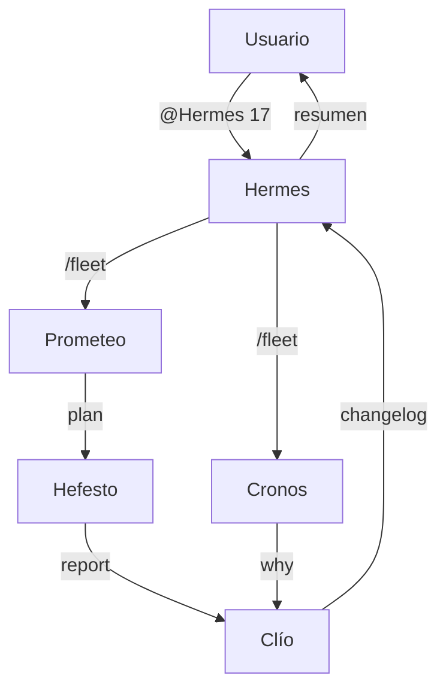
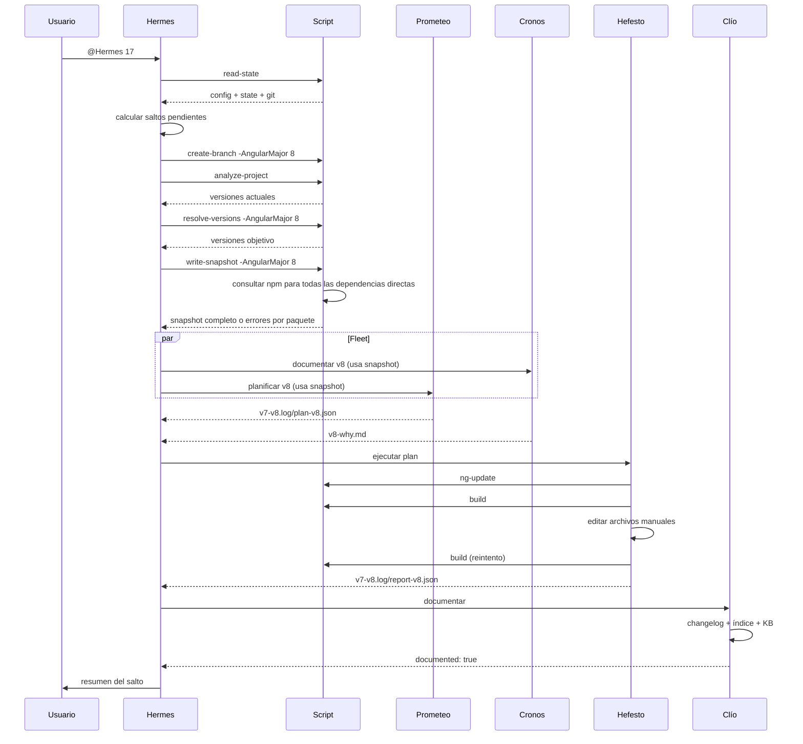

# Angular Migration Plugin — Plan v2

## Objetivo

Convertir el plugin actual en una herramienta **portable, determinista y auditable** para migrar cualquier proyecto Angular (7+) a versiones superiores, con fricción mínima para el usuario y cero improvisación de comandos por parte de los agentes LLM.

---

## 1. Principios de diseño v2

| Principio                  | Descripción                                                                                                    |
| -------------------------- | -------------------------------------------------------------------------------------------------------------- |
| **Determinismo**           | El script es la única fuente de verdad. Los agentes nunca inventan comandos ni versiones.                      |
| **Portabilidad**           | El plugin funciona en cualquier repo Angular sin configuración manual.                                         |
| **Observabilidad**         | Cada paso genera artefactos JSON y logs legibles. El usuario siempre sabe qué pasó.                            |
| **Recoverability**         | Un fallo no destruye el progreso. El estado persiste y permite reintentos.                                     |
| **Separation of concerns** | Hermes orquesta, Prometeo planifica, Hefesto ejecuta, Cronos y Clío documentan. Nadie hace el trabajo de otro. |

---

## 2. Arquitectura de agentes (revisada)



### Roles actualizados

| Agente       | Rol v2                                                                              | Tools permitidas                                                             |
| ------------ | ----------------------------------------------------------------------------------- | ---------------------------------------------------------------------------- |
| **Hermes**   | Orquestador. Lee estado, valida gates, crea rama, lanza fleet, verifica resultados. | `read`, `execute` (solo script), `todo`                                      |
| **Cronos**   | Documenta el "por qué" del salto usando snapshot de versiones.                      | `web`, `read`, `edit` (solo `docs/migration/`), `todo`                       |
| **Prometeo** | Consume snapshot, construye plan ejecutable, diagnostica fallos.                    | `execute` (solo `resolve-versions`), `read`, `edit` (solo plan), `todo`      |
| **Hefesto**  | Ejecuta plan: `ng-update`, ediciones manuales, build, commits.                      | `execute`, `read`, `edit`, `todo`                                            |
| **Clío**     | Documenta diff real, changelog, índice, KB.                                         | `read`, `edit` (solo `docs/migration/`), `execute` (solo crear dirs), `todo` |

---

## 3. Contratos del script (v2)

El script es una API estable para los agentes. Cada comando devuelve JSON estructurado.

### Comandos nuevos / actualizados

| Comando            | Propósito                                                                                            | Parámetros                                        |
| ------------------ | ---------------------------------------------------------------------------------------------------- | ------------------------------------------------- |
| `analyze-project`  | Lee `package.json`, detecta dependencias directas, genera snapshot de versiones actuales.            | `-AngularMajor` (opcional, para filtrar)          |
| `resolve-versions` | Calcula versiones objetivo compatibles con el major destino.                                         | `-AngularMajor`                                   |
| `write-snapshot`   | Persiste `.angular-migration/v{from}-v{N}.log/snapshot-v{N}.json` con versiones actuales y objetivo. | `-AngularMajor`                                   |
| `ng-update`        | Ejecuta `ng update` controlado con versiones específicas.                                            | `-AngularVersion`, `-CliVersion`, `-BuildVersion` |
| `build`            | Ejecuta build, captura errores y warnings en JSON.                                                   | —                                                 |
| `diff`             | Devuelve archivos modificados, estadísticas y diff resumido.                                         | `-BaseRef`                                        |
| `commit`           | Commit atómico con mensaje y hash devueltos.                                                         | `-CommitMessage`                                  |
| `complete-step`    | Registra salto en state.json.                                                                        | `-AngularMajor`                                   |
| `read-state`       | Devuelve config + state + git status.                                                                | —                                                 |
| `init`             | Crea `.angular-migration/` en el repo del usuario (no en el plugin).                                 | —                                                 |

### Cambio crítico: rutas de estado

**Antes (v1 — bug):**

```powershell
$MIGRATION_DIR = Join-Path $PSScriptRoot '.angular-migration'
```

**Después (v2 — correcto):**

```powershell
$PROJECT_ROOT = Get-Location
$MIGRATION_DIR = Join-Path $PROJECT_ROOT '.angular-migration'
```

El script vive en el plugin, pero **todos los artefactos se escriben en el repo del usuario**. `init` también añade `.angular-migration/` al `.gitignore` del proyecto.

---

## 4. Flujo de migración v2 (por salto)



---

## 5. Mejoras de logging y observabilidad

### Estructura de artefactos y logs por salto

```
.angular-migration/
├── config.json               # configuración global del proyecto
├── state.json                # estado global de la migración
└── v7-v8.log/
    ├── snapshot-v8.json      # versiones actuales vs objetivo
    ├── plan-v8.json          # plan de Prometeo
    ├── report-v8.json        # resultado de Hefesto
    └── logs/
        ├── hermes.log       # decisiones del orquestador
        ├── hefesto.log      # comandos ejecutados y salidas
        └── build.log        # stdout/stderr completos del build
```

### Logging en agentes

Cada agente debe registrar en su respuesta:

- Qué ficheros leyó
- Qué comandos ejecutó (o delegó al script)
- Qué decisiones tomó y por qué
- Qué artefactos produjo

### Estado de warnings

El build no termina hasta que:

- `errors: []` — bloqueante
- `warnings: []` — objetivo ideal
- `warnings: [...]` — cada warning debe estar clasificado como:
  - `resolved` — corregido por Hefesto
  - `accepted` — documentado como no bloqueante
  - `deferred` — pospuesto con justificación

---

## 6. Portabilidad: para cualquier proyecto Angular

### Sin requisitos manuales

El plugin debe funcionar sin que el usuario:

- Edite paths en ficheros
- Instale dependencias globales adicionales
- Conozca la estructura interna del plugin

### Detección automática

| Aspecto          | Cómo se detecta                                                 |
| ---------------- | --------------------------------------------------------------- |
| Proyecto Angular | Presencia de `angular.json` o `@angular/core` en `package.json` |
| Versión actual   | `package.json` → `@angular/core`                                |
| Ionic            | `@ionic/angular` en dependencias                                |
| Node manager     | `Get-Command fnm`, fallback `nvm`                               |
| Node requerido   | Tabla de compatibilidad Angular↔Node                            |

### Validaciones automáticas (init)

1. ¿Es un proyecto Angular?
2. ¿Está en la raíz del repo?
3. ¿Node activo es compatible con el major destino?
4. ¿Working tree limpio?
5. ¿`.angular-migration/` existe? Crear + gitignore.

---

## 7. Mejoras de resiliencia

### Reintentos inteligentes

| Fallo                           | Acción                                                  |
| ------------------------------- | ------------------------------------------------------- |
| `ng update` falla por peer deps | Reintentar con `--force` (máx 1 vez, log explícito)     |
| Build falla                     | Hefesto aplica auto-fixes conocidos, máx 3 iteraciones  |
| Error desconocido               | Prometeo diagnostica, actualiza plan, Hefesto reintenta |
| 3er fallo consecutivo           | Hermes detiene, expone historial completo               |

### Estado persistente

Cada paso exitoso persiste inmediatamente. Si el proceso se interrumpe:

- `read-state` permite reanudar desde el último checkpoint
- `completed_steps` evita repetir saltos ya hechos

---

## 8. Documentación generada (v2)

```
docs/migration/
├── _index.md                    # índice global de saltos
├── _errors-knowledge.md         # KB de fixes acumulados
├── _runbook.md                  # cómo usar el plugin (para humanos)
└── v{N}/
    ├── v{N}-why.md              # qué cambió y por qué (Cronos)
    ├── v{N}-changelog.md        # qué se hizo, versión a versión (Clío)
    └── v{N}-diff.md             # diff resumido con archivos clave (Clío, opcional)
```

---

## 9. Métricas de éxito v2

| Métrica                  | Objetivo                                             |
| ------------------------ | ---------------------------------------------------- |
| Tiempo por salto         | < 5 minutos (salto estándar sin conflictos)          |
| Intervención del usuario | Solo en gates (Node, working tree) o 3er fallo       |
| Warnings sin resolver    | 0 por defecto, máximo 3 aceptados con justificación  |
| Commits por salto        | 3-5 (instalar, cambios manuales, checkpoint)         |
| Rollback                 | `git reset --hard` antes de la rama funciona siempre |

---

## 10. Roadmap de implementación

### Fase 1 — Fundamentos (crítico)

- [ ] Corregir `$PSScriptRoot` → `Get-Location` en script
- [ ] Añadir `analyze-project` y `write-snapshot`
- [ ] Añadir `ng-update` con flags controlados
- [x] Logging estructurado en `.angular-migration/v{from}-v{to}.log/logs/`

### Fase 2 — Agentes

- [ ] Actualizar Hermes con nuevo flujo de snapshot
- [ ] Actualizar Cronos para consumir snapshot
- [ ] Actualizar Prometeo para no resolver versiones manualmente
- [ ] Actualizar Hefesto con contrato de `ng-update`
- [ ] Actualizar Clío con diff real

### Fase 3 — Calidad

- [ ] Tests del script (Pester o similar)
- [ ] Validación de JSON schemas
- [ ] Documentación de usuario final

---

## 11. Decisiones tomadas

| Decisión                           | Resolución                            | Justificación                                                                                                                                                                                                |
| ---------------------------------- | ------------------------------------- | ------------------------------------------------------------------------------------------------------------------------------------------------------------------------------------------------------------ |
| `ng update --force`                | **Automático solo si ERESOLVE**       | Los conflictos de peer deps son el caso habitual en saltos de major. Un reintento con `--force` (máx 1) resuelve el 90% sin intervenir al usuario. Se registra explícitamente en el log y en el reporte.     |
| Warnings bloqueantes               | **No bloqueantes, pero clasificados** | Un warning no impide el salto, pero cada uno queda clasificado (`resolved` / `accepted` / `deferred`) en el reporte y en el changelog. Visibilidad total, sin frenar la migración.                           |
| Multi-proyecto (workspace Angular) | **No en v2 — single-app**             | El target real del plugin son apps Angular/Ionic clásicas con un solo `angular.json` de app. Soportar workspaces multiplica la complejidad de `ng update`, builds y rutas. Si aparece la demanda, será v2.1. |
| Migraciones no secuenciales        | **No — solo major por major**         | Angular solo garantiza rutas de migración y schematics de `ng update` entre majors consecutivos. Saltar versiones (7→15) rompe los schematics intermedios. La cadena de saltos es obligatoria, no opcional.  |

---

_Documento de diseño final — Angular Migration Plugin v2 — 2026-08-24_
