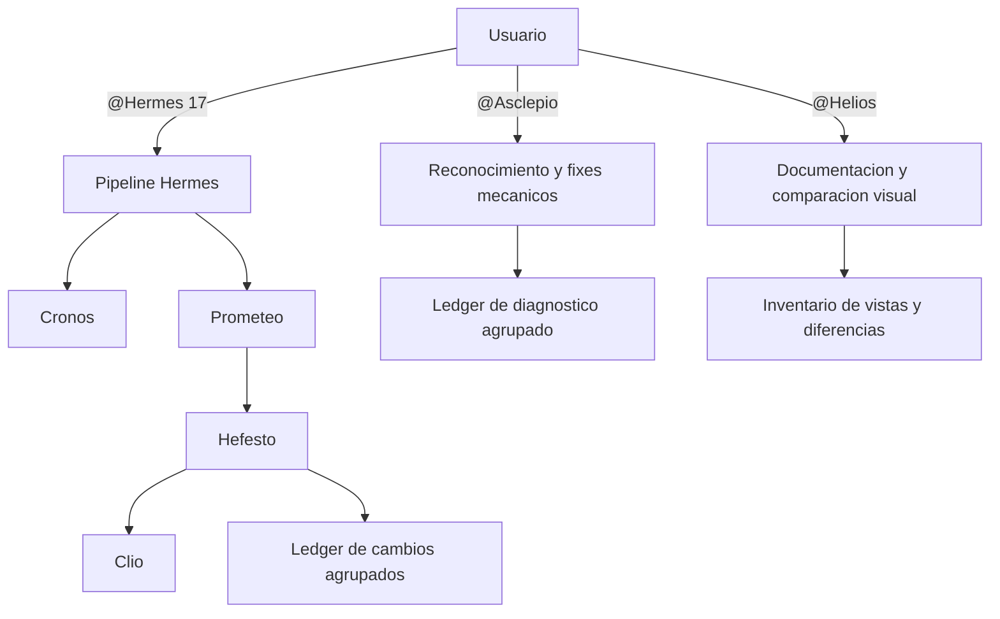

# Angular Migration Plugin - Plan v3

## Objetivo

Evolucionar el plugin v2 en tres direcciones sin ampliar la responsabilidad de Hermes:

1. Registrar de forma estructurada, legible y auditable todos los cambios aplicados a los ficheros.
2. Añadir un agente autonomo de reconocimiento y reparacion mecanica del codigo.
3. Añadir un agente autonomo de documentacion y comparacion visual de vistas.

La pipeline de migracion mantiene sus cinco agentes. Los dos agentes nuevos son herramientas independientes, invocables directamente por el usuario y sin relacion de dependencia con Hermes.

---

## 1. Principios de diseño v3

| Principio              | Aplicacion                                                                                               |
| ---------------------- | -------------------------------------------------------------------------------------------------------- |
| Trazabilidad semantica | El log explica que transformacion se hizo, por que y donde, no solo que fichero cambio.                  |
| Agrupacion             | Una misma transformacion aplicada 40 veces produce una entrada con 40 elementos en `occurrences`.        |
| Evidencia verificable  | Cada cambio indica su origen, validacion y resultado.                                                    |
| Cero cambios logicos   | El agente de reconocimiento solo aplica reparaciones mecanicas demostrables.                             |
| Independencia          | Asclepio y Helios no forman parte del fleet ni aparecen en la lista de subagentes de Hermes.             |
| Artefactos separados   | Los datos de maquina viven en `.angular-migration/`; la documentacion util para humanos vive en `docs/`. |
| Reutilizacion          | El runtime aislado de Playwright se comparte, pero cada flujo tiene su propio runner y contrato.         |

---

## 2. Arquitectura v3



### Responsabilidades

| Agente   | Invocable | Responsabilidad                                                                     | Fuera de alcance                                      |
| -------- | --------- | ----------------------------------------------------------------------------------- | ----------------------------------------------------- |
| Hermes   | Si        | Orquestar la migracion major por major.                                             | Reconocimiento general y regresion visual.            |
| Asclepio | Si        | Detectar problemas y aplicar fixes mecanicos seguros con las herramientas del repo. | Upgrades, refactors y cambios de logica de negocio.   |
| Helios   | Si        | Inventariar rutas, documentar vistas y comparar dos despliegues con Playwright.     | Modificar la aplicacion o participar en la migracion. |

`agents/Hermes.agent.md` conserva `agents: ["Prometeo", "Hefesto", "Cronos", "Clio"]`. Asclepio y Helios tienen `user-invocable: true`, no delegan y no son invocados por Hermes.

---

## 3. Logging de cambios agrupados

### Problema actual

`hefesto.log` y `build.log` son utiles para diagnostico operativo, mientras que `report-v{to}.json` solo contiene listas resumidas. Ninguno representa bien una transformacion repetida en muchos ficheros o ubicaciones.

### Nuevo artefacto canonico

Cada salto crea:

```text
.angular-migration/v{from}-v{to}.log/
├── changes-v{to}.json
├── report-v{to}.json
└── logs/
```

`changes-v{to}.json` es la fuente de verdad de los cambios aplicados. Los logs de texto se mantienen para stdout, stderr y diagnostico, pero Clio genera la documentacion humana desde este ledger.

### Esquema propuesto

```json
{
  "schema_version": 1,
  "run": {
    "kind": "migration",
    "from": 7,
    "to": 8,
    "agent": "Hefesto",
    "started_at": "2026-08-27T10:00:00Z",
    "finished_at": "2026-08-27T10:04:00Z"
  },
  "groups": [
    {
      "id": "ionic-css-attribute-to-class",
      "category": "template",
      "source": "manual|schematic|formatter|linter",
      "summary": "Sustituir atributos CSS de Ionic por clases equivalentes",
      "reason": "Los atributos CSS estan obsoletos en la version objetivo",
      "transformation": {
        "before": "padding-end",
        "after": "class=\"ion-padding-end\""
      },
      "occurrences": [
        {
          "file": "src/app/home/home.page.html",
          "location": "ion-item",
          "status": "applied"
        }
      ],
      "count": 1,
      "validation": {
        "command": "build",
        "status": "passed"
      },
      "commit": "abc1234"
    }
  ],
  "summary": {
    "groups": 1,
    "occurrences": 1,
    "files": 1
  }
}
```

### Reglas de agrupacion

- La clave de grupo es `id + transformation + reason`, nunca el nombre del fichero.
- Cada ubicacion afectada se añade a `occurrences[]`; no se duplica la explicacion.
- `count` debe coincidir con la longitud de `occurrences` y se calcula al cerrar el ledger.
- Un mismo fichero puede aparecer varias veces si contiene varias ubicaciones afectadas.
- Los cambios de schematics, fixes manuales, linters y formatters se registran con distinto `source`.
- No se guardan diffs completos ni contenido sensible. `before` y `after` describen el patron minimo.
- Los cambios detectados pero no aplicados usan `status: skipped` y explican `reason`; no se mezclan con cambios aplicados.
- Las rutas son relativas a la raiz del proyecto y las entradas se ordenan por `id`, fichero y ubicacion para producir resultados deterministas.

### Contratos del script

Añadir al script una API pequeña para que el formato no dependa de texto generado por agentes:

| Comando          | Proposito                                                            |
| ---------------- | -------------------------------------------------------------------- |
| `changes-init`   | Crea el ledger del salto o diagnostico con metadata de la ejecucion. |
| `changes-record` | Inserta una ocurrencia y la agrupa por la clave semantica.           |
| `changes-close`  | Ordena, calcula contadores, valida el esquema y cierra timestamps.   |
| `changes-read`   | Devuelve el ledger para Hefesto, Asclepio y Clio.                    |

Los comandos aceptan datos estructurados mediante un fichero JSON temporal o parametros definidos; nunca mediante concatenacion manual de JSON en shell. Las escrituras deben ser atomicas (`.tmp` y rename) para no corromper el ledger si se interrumpe el proceso.

### Integracion con agentes existentes

- Hefesto inicializa el ledger antes de `ng-update` y registra schematics, cambios manuales y auto-fixes.
- Tras cada commit, Hefesto asocia su hash a los grupos pendientes.
- `report-v{to}.json` incorpora `changes_file`, `change_groups`, `change_occurrences` y `changed_files`; deja de duplicar descripciones extensas.
- Clio añade al changelog una tabla por grupo con descripcion, motivo, cantidad y lista plegable de ficheros.
- Hermes verifica que el ledger exista, cierre correctamente y cuadre con `report.diff.files` antes de aceptar el salto.
- Las diferencias que solo provengan de lockfiles o formato se registran como grupos explicitos, no como ruido sin explicar.

### Validacion de integridad

Un salto no se marca como completado si:

- El JSON no valida contra `schemas/changes.schema.json`.
- `count` no coincide con `occurrences.length`.
- Un fichero de `report.diff.files` no esta cubierto por al menos un grupo, salvo artefactos ignorados declarados.
- Una ocurrencia `applied` no tiene validacion asociada al grupo.

---

## 4. Asclepio: agente autonomo de reconocimiento

### Proposito

Asclepio inspecciona un proyecto Angular existente, entiende sus versiones y herramientas, escanea `src/` por completo, detecta incompatibilidades conocidas y aplica unicamente fixes mecanicos que no alteren la logica.

Invocacion:

```text
@Asclepio
```

Opcionalmente acepta `scan-only` para generar el diagnostico sin editar.

### Flujo

1. Verifica que el cwd sea la raiz del proyecto y lee `package.json`, lockfile, `angular.json`, tsconfigs y configuracion de lint/test.
2. Detecta versiones efectivas de Angular, TypeScript, RxJS, Ionic y Node sin resolver upgrades.
3. Descubre las herramientas ya declaradas por el repo: scripts npm, ESLint/TSLint, formatter, tests y build.
4. Crea un inventario completo de `src/`, respetando ignores del repo y excluyendo generados, bundles y dependencias.
5. Ejecuta primero checks de solo lectura: typecheck, lint, tests y build disponibles.
6. Busca patrones incompatibles con las versiones instaladas mediante un catalogo versionado de reglas.
7. Clasifica cada hallazgo como `safe-fix`, `review` o `informational` con fichero, ubicacion, evidencia y regla.
8. En modo normal aplica solo `safe-fix`: autofix oficial del linter/formatter o transformacion determinista incluida en el catalogo.
9. Repite los checks que pueden falsar el fix. Un fix que introduce errores queda marcado como fallido y el agente se detiene sin intentar refactors.
10. Escribe el reporte y el ledger agrupado; no crea commits.

### Limites de seguridad

Asclepio puede:

- Ejecutar herramientas ya presentes en el proyecto con sus configuraciones existentes.
- Corregir imports obsoletos, opciones retiradas, firmas mecanicas conocidas, reglas autofixables y formato.
- Editar configuracion solo cuando una regla versionada define exactamente el cambio.

Asclepio no puede:

- Cambiar versiones ni instalar dependencias.
- Renombrar conceptos de dominio, reestructurar componentes o cambiar flujos de datos.
- Inventar valores para rutas parametrizadas, APIs, credenciales o configuracion de negocio.
- Aplicar un fix ambiguo. Esos hallazgos quedan en `review` con una recomendacion, sin editar.
- Usar `--force`, borrar ficheros, hacer reset, commit, push o modificar contenido fuera del repo.

### Artefactos

```text
.angular-migration/diagnostics/{timestamp}/
├── inventory.json
├── findings.json
├── changes.json
└── logs/
    ├── lint.log
    ├── test.log
    └── build.log

docs/diagnostics/
└── diagnostic-{date}.md
```

`findings.json` conserva todos los hallazgos. `changes.json` usa el mismo esquema agrupado del logging v3 y solo contiene cambios realmente intentados. El Markdown resume versiones, checks, grupos corregidos y problemas que requieren revision humana.

### Catalogo de reglas

Crear `rules/angular-patterns.json` con reglas declarativas versionadas:

- Identificador estable y versiones a las que aplica.
- Globs y patron detectable.
- Severidad y evidencia.
- Tipo `safe-fix`, `review` o `informational`.
- Transformacion permitida y check de validacion.

Las reglas complejas que necesiten entender AST no deben resolverse con regex. Se usa el compilador TypeScript o la herramienta oficial ya instalada en el proyecto.

---

## 5. Helios: agente autonomo de vistas y comparacion visual

### Proposito

Helios documenta todas las vistas alcanzables desde el router Angular y compara visualmente las mismas rutas entre dos URLs usando pestañas compartidas del browser integrado.

Invocacion:

```text
@Helios
```

### Conversacion obligatoria

1. El usuario abre la URL base en el browser integrado, inicia sesión si es necesario y comparte la pestaña con el agente.
2. Helios descubre rutas y captura la referencia completa desde esa pestaña.
3. Cuando termina la referencia, el usuario abre la segunda URL, inicia sesión si es necesario y comparte otra pestaña.
4. Helios captura las mismas rutas, compara y publica el resultado.

Solo acepta URLs `http://` o `https://`. Nunca registra cookies, tokens, cabeceras de autorizacion ni valores de formularios.

### Descubrimiento de vistas

Helios combina dos fuentes:

- **Fuente estatica:** lee `angular.json` y las definiciones `Routes`/`RouterModule`/`provideRouter`, incluyendo lazy loading, redirects, children y wildcards.
- **Fuente runtime:** usa la pestaña base compartida para confirmar navegacion, URL final, titulo y estado observable.

Cada ruta se normaliza. Redirects apuntan a la vista final y no generan capturas duplicadas. Las rutas con parametros, guards, autenticacion o datos obligatorios se incluyen en el inventario como `blocked` si no pueden visitarse de forma segura; nunca se inventan parametros ni se solicitan credenciales.

### Captura desde el browser integrado

- Viewports iniciales: desktop `1440x900` y movil `390x844`; configurables por invocacion.
- Usa `screenshotPage` sobre las pestañas autenticadas compartidas.
- Mantiene el mismo viewport y la misma ruta en cada par de capturas.
- Lee la vista antes de capturar y registra errores observables junto a cada ruta.
- Sanitiza nombres de ruta para generar identificadores estables.

### Comparacion

Helios compara cada par de capturas y genera para cada viewport:

- Porcentaje de pixeles diferentes.
- Dimensiones y estado de carga.
- Referencia, candidata, estado y métricas del resultado.

Una ruta ausente, un error de navegacion o dimensiones distintas cuenta como diferencia. Las capturas se conservan en la sesión de Copilot; el repositorio guarda el manifiesto y el informe.

### Artefactos

```text
.angular-migration/vision/{run-id}/
├── routes.json
└── results.json

docs/views/
├── _index.md                     # todas las vistas y su estado
└── comparisons/{run-id}/
    ├── report.md
    └── {route}/{viewport}/       # resultados diferentes
```

`_index.md` documenta todas las rutas, incluso `unchanged`, `blocked` y `failed`. La carpeta de imagenes solo contiene rutas `different`, cumpliendo la regla de no guardar capturas iguales.

### Compatibilidad con automatizaciones externas

`scripts/playwright-vision.js` y `vision-run` se conservan como utilidad determinista para automatizaciones externas. Helios no los invoca: un runner separado no puede reutilizar la sesión autenticada de una pestaña compartida del browser integrado. El agente tampoco solicita ni copia cookies, tokens o `storageState`.

---

## 6. Cambios previstos por fichero

| Fichero                           | Cambio                                                                                |
| --------------------------------- | ------------------------------------------------------------------------------------- |
| `plugin.json`                     | Version `3.0.0`, descripcion de siete agentes y nuevas palabras clave.                |
| `README.md`                       | Documentar los tres puntos de entrada: Hermes, Asclepio y Helios.                     |
| `agents/Hefesto.agent.md`         | Integrar el ledger y exigir cobertura de todos los ficheros modificados.              |
| `agents/Hermes.agent.md`          | Añadir el gate de integridad del ledger, sin incorporar agentes nuevos a su pipeline. |
| `agents/Clio.agent.md`            | Generar changelog desde grupos y ocurrencias.                                         |
| `agents/Asclepio.agent.md`        | Nuevo agente autonomo de reconocimiento y safe-fix.                                   |
| `agents/Helios.agent.md`          | Nuevo agente autonomo de documentacion visual.                                        |
| `scripts/angular-migration.ps1`   | Comandos del ledger y preparacion de dependencias visuales.                           |
| `scripts/playwright-vision.js`    | Descubrimiento runtime, capturas y comparacion.                                       |
| `schemas/changes.schema.json`     | Contrato formal del ledger.                                                           |
| `schemas/vision.schema.json`      | Contrato de rutas y comparaciones.                                                    |
| `rules/angular-patterns.json`     | Catalogo inicial de patrones por version.                                             |
| `tests/smoke.ps1`                 | Tests de agrupacion, integridad y registro de agentes.                                |
| `tests/vision-fixture/`           | App HTML minima para probar capturas iguales y diferentes.                            |
| `.github/plugin/marketplace.json` | Descripcion v3 y exposicion de capacidades independientes.                            |

---

## 7. Roadmap de implementacion

### Fase 1 - Ledger de cambios

- [x] Definir `changes.schema.json` y casos validos/invalidos.
- [x] Implementar `changes-init`, `changes-record`, `changes-close` y `changes-read`.
- [x] Añadir agrupacion determinista y escritura atomica.
- [x] Integrar Hefesto, Hermes y Clio.
- [x] Probar 40 ocurrencias de una misma transformacion como un unico grupo.

### Fase 2 - Asclepio

- [x] Crear el contrato del agente y sus fronteras de herramientas.
- [x] Implementar inventario de proyecto y descubrimiento de comandos existentes.
- [x] Crear el catalogo inicial con pocas reglas mecanicas de alta confianza.
- [x] Implementar modos normal y `scan-only`.
- [x] Validar que un hallazgo ambiguo nunca modifica codigo.

### Fase 3 - Helios

- [x] Crear el contrato conversacional de dos pestañas compartidas.
- [x] Implementar extraccion estatica de rutas Angular.
- [x] Implementar captura browser-native y manejo de rutas bloqueadas.
- [x] Implementar comparación de pares de capturas y registro de resultados.
- [x] Generar indice de vistas y reporte de diferencias.

### Fase 4 - Empaquetado y documentacion

- [x] Actualizar metadata a v3 y README.
- [x] Extender smoke tests y añadir fixtures visuales sin red.
- [x] Verificar metadata de marketplace y descubrimiento de los tres agentes invocables.
- [x] Ejecutar smoke, validacion de schemas y prueba visual end-to-end.

---

## 8. Criterios de aceptacion

### Logging

- Una transformacion aplicada 40 veces aparece como un grupo con `count: 40` y 40 ocurrencias.
- Cada fichero del diff queda explicado por al menos un grupo o una exclusion declarada.
- Clio puede generar el changelog sin interpretar logs de texto.
- Un ledger incompleto o invalido impide completar el salto.

### Asclepio

- Detecta las versiones y herramientas desde el repo sin instalar nada.
- Escanea todo `src/` y reporta exclusiones.
- Solo modifica hallazgos `safe-fix` y demuestra el resultado con checks del repo.
- No cambia dependencias, logica, ramas ni historial Git.
- Agrupa fixes repetidos mediante el mismo contrato de cambios v3.

### Helios

- Usa dos pestañas autenticadas compartidas y solo pide la candidata después de capturar la base.
- Documenta todas las rutas descubiertas, incluidas las bloqueadas o fallidas.
- Compara cada ruta visitable en desktop y movil.
- Conserva el resultado de cada par de capturas y publica las diferencias en el informe.
- No modifica la aplicacion ni expone datos de sesion.

---

## 9. Riesgos y decisiones

| Tema                            | Decision v3                                         | Motivo                                                                                     |
| ------------------------------- | --------------------------------------------------- | ------------------------------------------------------------------------------------------ |
| Agentes dentro de Hermes        | No                                                  | Son herramientas de auditoria que deben poder ejecutarse en cualquier momento.             |
| Auto-fix de Asclepio            | Solo mecanico y verificable                         | Un scanner autonomo no debe reinterpretar logica de negocio.                               |
| Regex sobre TypeScript complejo | No                                                  | Para transformaciones estructurales se usa AST o herramienta oficial.                      |
| Rutas dinamicas                 | Se documentan como bloqueadas sin valores conocidos | Inventar parametros puede producir resultados falsos o acciones peligrosas.                |
| Sesiones autenticadas           | Pestañas compartidas del browser integrado          | Mantienen el login real sin copiar credenciales al agente.                                 |
| Capturas                        | Sesión visual de Copilot y resultados en el repo    | `screenshotPage` no se trata como un PNG local hasta que exista una exportación soportada. |
| Comparacion por IA visual       | No en v3                                            | Un diff de pixeles es determinista, barato y auditable.                                    |
| Logs de texto actuales          | Se mantienen                                        | Siguen siendo necesarios para diagnosticar comandos y errores.                             |

---

## 10. Resultado esperado

La v3 conserva una pipeline de migracion pequeña y especializada, y añade dos entradas laterales:

- **Hermes** migra y deja cada cambio explicado y agrupado.
- **Asclepio** revisa y corrige problemas mecanicos sin tocar la logica.
- **Helios** documenta el router y conserva solo regresiones visuales reales entre dos URLs.

El resultado es un plugin mas auditable y util fuera de una migracion, sin convertir a Hermes en un orquestador de tareas que no le corresponden.

---

_Documento de diseño - Angular Migration Plugin v3 - 2026-08-27_
